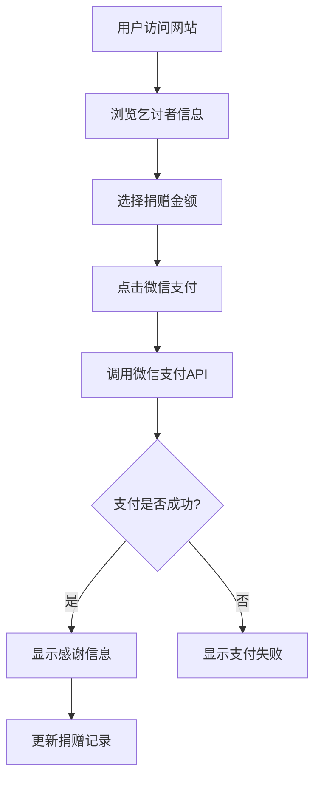

## 1. Product Overview
赛博乞讨网站是一个具有赛博朋克美学风格的在线乞讨平台，允许用户通过微信支付进行捐赠。目标用户为寻求网络乞讨的人群和愿意进行小额捐赠的网络用户。

## 2. Core Features

### 2.1 User Roles
| Role | Registration Method | Core Permissions |
|------|---------------------|------------------|
| Donor | 无需注册 | 浏览乞讨者信息，进行微信支付捐赠 |
| Beggar | 网站后台注册 | 创建乞讨页面，查看捐赠记录 |

### 2.2 Feature Module
1. **Hero页面**: 赛博朋克风格主视觉区，展示乞讨者信息
2. **捐赠模块**: 微信支付集成，支持多种金额选择
3. **捐赠记录**: 实时显示捐赠者和金额信息
4. **乞讨者主页**: 展示个人故事、目标金额、进度条

### 2.3 Page Details
| Page Name | Module Name | Feature description |
|-----------|-------------|---------------------|
| Home page | Hero section | 赛博朋克风格动画背景，动态文字效果 |
| Home page | Donation Panel | 金额选择按钮，微信支付按钮，支付状态反馈 |
| Home page | Donation Records | 实时滚动显示最新捐赠记录 |
| Home page | Progress Bar | 目标金额进度展示，霓虹发光效果 |

## 3. Core Process
用户进入网站 → 浏览乞讨者信息 → 选择捐赠金额 → 点击微信支付 → 调用微信支付API → 支付成功后显示感谢信息并更新捐赠记录

## 4. User Interface Design

### 4.1 Design Style
- **Primary Color**: 霓虹青色 (#00ffff)
- **Secondary Color**: 霓虹粉色 (#ff00ff)
- **Background**: 深黑色 (#0a0a0f) 带网格线条
- **Button Style**: 霓虹发光效果，圆角，悬停时脉冲动画
- **Font**: 科技感字体，如 Orbitron
- **Layout**: 暗色系赛博朋克风格，网格背景，全息投影效果
- **Animation**: 扫描线效果，文字发光动画，背景粒子效果

### 4.2 Page Design Overview
| Page Name | Module Name | UI Elements |
|-----------|-------------|-------------|
| Home page | Hero section | 动态网格背景、赛博朋克标题、全息投影效果 |
| Home page | Donation Panel | 金额选择按钮(5/10/20/50元)、自定义金额输入、微信支付按钮 |
| Home page | Progress Bar | 霓虹发光进度条、目标金额/已筹金额显示 |
| Home page | Donation Records | 滚动列表、捐赠者昵称、金额、时间戳 |

### 4.3 Responsiveness
- Desktop-first design
- Mobile-adaptive: 响应式布局，触摸优化按钮尺寸
- Tablet: 中等屏幕适配

### 4.4 Special Effects
- 霓虹发光效果
- 扫描线动画
- 背景粒子系统
- 文字故障效果(Glitch)