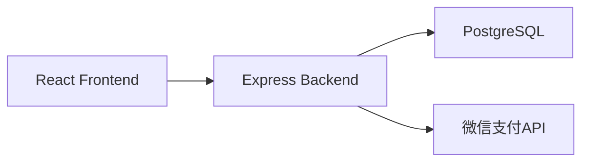
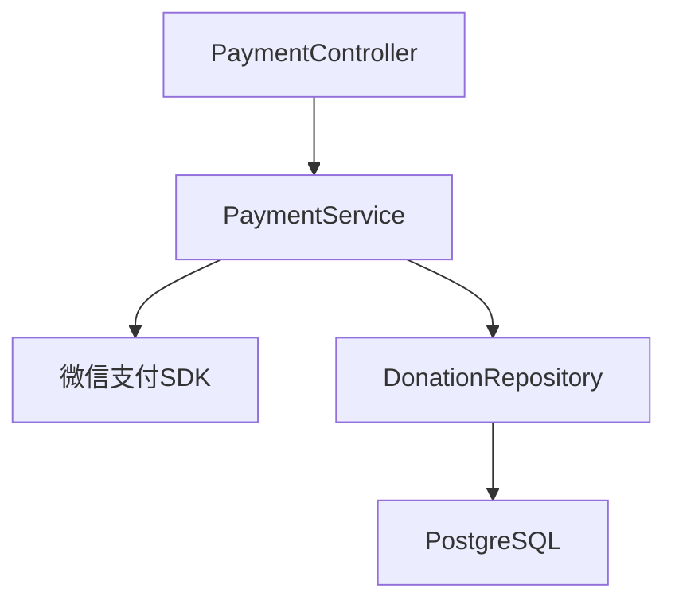
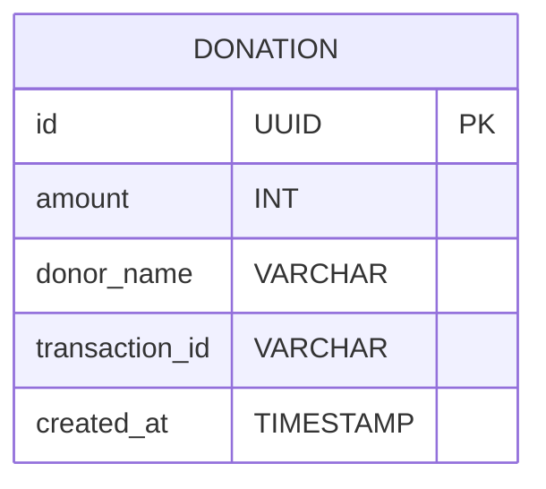

## 1. Architecture Design


## 2. Technology Description
- Frontend: React@18 + tailwindcss@3 + vite
- Initialization Tool: vite-init
- Backend: Express@4 + TypeScript
- Database: PostgreSQL (via Supabase)
- Payment: 微信支付API (商户号模式)

## 3. Route Definitions
| Route | Purpose |
|-------|---------|
| / | 赛博乞讨主页 |
| /api/payment/create | 创建微信支付订单 |
| /api/payment/notify | 微信支付回调 |
| /api/donations | 获取捐赠记录 |

## 4. API Definitions

### 4.1 创建支付订单
**POST** `/api/payment/create`

请求体:
```typescript
{
  amount: number;      // 金额(分)
  openid?: string;     // 用户openid(可选)
  description: string; // 商品描述
}
```

响应:
```typescript
{
  success: boolean;
  data?: {
    prepay_id: string;
    timestamp: string;
    nonce_str: string;
    package: string;
    sign_type: string;
    pay_sign: string;
  };
  message?: string;
}
```

### 4.2 支付回调
**POST** `/api/payment/notify`

微信支付回调数据(自动处理)

### 4.3 获取捐赠记录
**GET** `/api/donations`

响应:
```typescript
{
  success: boolean;
  data: Array<{
    id: string;
    amount: number;
    donor_name: string;
    created_at: string;
  }>;
}
```

## 5. Server Architecture Diagram


## 6. Data Model

### 6.1 Data Model Definition


### 6.2 Data Definition Language
```sql
CREATE TABLE donations (
    id UUID PRIMARY KEY DEFAULT gen_random_uuid(),
    amount INT NOT NULL,
    donor_name VARCHAR(100),
    transaction_id VARCHAR(255),
    created_at TIMESTAMP DEFAULT NOW()
);

GRANT SELECT ON donations TO anon;
GRANT ALL PRIVILEGES ON donations TO authenticated;
```

## 7. Environment Variables
```
WECHAT_APPID=微信公众号APPID
WECHAT_MCHID=微信商户号
WECHAT_API_KEY=微信支付API密钥
WECHAT_NOTIFY_URL=支付回调地址
SUPABASE_URL=Supabase URL
SUPABASE_KEY=Supabase ANON KEY
```